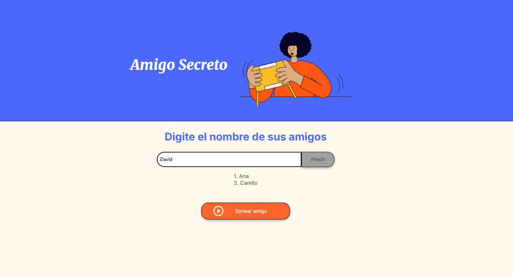
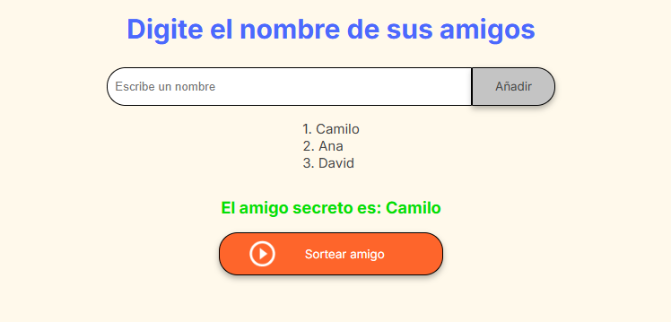

# Proyecto de "Amigo Secreto"

Esa es una aplicación que permita a los usuarios ingresar nombres de amigos en una lista para luego realizar un sorteo aleatorio y determinar quién es el "amigo secreto".

## Area de juego 
En esta unica pagina se hara el ingreso de los participantes y se desarollara el sorteo 

## Ingreso de nombres para el sorteo 
En el area indicada hacemos el ingreso de los nombres de los particiapantes, y consiguiente a cada nombre pulsamos el boton añadir 

## Sorteo 

Luego del ingreso de todos los participantes, pulsamos el boton sorteo y en el area inferior aparecera el seleccionado para ser el amigo secreto 

## Funcionalidades

- **Hacer un sorteo:** Recibe el ingreso de los nombres de los participantes creando un listado, para luego hacer un sorteo sobre ese listado 

## Tech Stack

**Frontend:** HTML, CSS, Javascript

